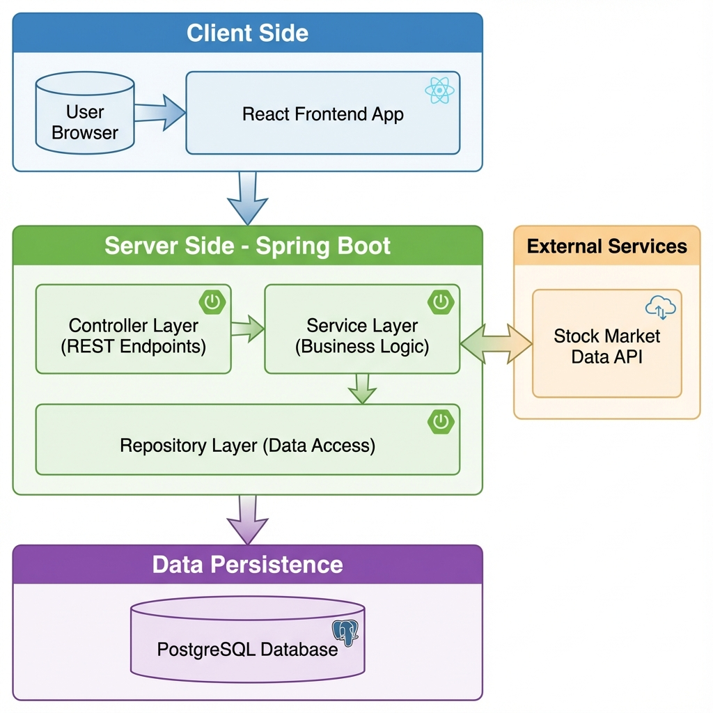

# System Design Document - VAMPZ

**Prepared for:** VAMPZ Development Team
**Date:** November 29, 2025
**Prepared by:** Antigravity (AI Assistant)

---

## Table of Contents

1. [Cover Page](#system-design-document---vampz)
2. [CRC Cards](#crc-cards)
3. [Software Architecture Diagram](#software-architecture-diagram)

---

## CRC Cards

The following Class-Responsibility-Collaborator (CRC) cards represent the key components of the VAMPZ application, divided into Backend (Spring Boot) and Frontend (React).

### Backend Components

#### User Management & Authentication

| **Class Name:** LoginController | |
| :--- | :--- |
| **Responsibilities** | **Collaborators** |
| - Handle user login requests. | - `AppUserService` |
| - Generate and return JWT tokens (if applicable) or session details. | - `LoginRequest` |

<br>

| **Class Name:** RegistrationController | |
| :--- | :--- |
| **Responsibilities** | **Collaborators** |
| - Handle new user registration requests. | - `RegistrationService` |
| - Validate registration data. | - `RegistrationRequest` |

<br>

| **Class Name:** AppUserService | |
| :--- | :--- |
| **Responsibilities** | **Collaborators** |
| - Load user details by username/email. | - `UserRepository` |
| - Manage user roles and password encoding. | - `AppUser` |

<br>

| **Class Name:** UserRepository | |
| :--- | :--- |
| **Responsibilities** | **Collaborators** |
| - Persist and retrieve `AppUser` entities from the database. | - `AppUser` |

#### Portfolio & Trading

| **Class Name:** PortfolioController | |
| :--- | :--- |
| **Responsibilities** | **Collaborators** |
| - Expose endpoints for retrieving and managing portfolios. | - `PortfolioService` |
| - Handle requests to get portfolio performance/value. | - `Portfolio` |

<br>

| **Class Name:** PortfolioService | |
| :--- | :--- |
| **Responsibilities** | **Collaborators** |
| - Business logic for portfolio management. | - `PortfolioRepository` |
| - Calculate total portfolio value. | - `HoldingService` |
| - Coordinate with transaction services. | - `TransactionService` |

<br>

| **Class Name:** PortfolioRepository | |
| :--- | :--- |
| **Responsibilities** | **Collaborators** |
| - Persist and retrieve `Portfolio` entities. | - `Portfolio` |

<br>

| **Class Name:** TransactionService | |
| :--- | :--- |
| **Responsibilities** | **Collaborators** |
| - Execute buy/sell orders. | - `TransactionRepository` |
| - Validate transaction feasibility (funds, ownership). | - `PortfolioService` |
| - Record transaction history. | - `Transaction` |

<br>

| **Class Name:** HoldingService | |
| :--- | :--- |
| **Responsibilities** | **Collaborators** |
| - Manage current stock holdings for a portfolio. | - `HoldingRepository` |
| - Update holding quantities after transactions. | - `Holding` |

#### Market Data & Watchlist

| **Class Name:** MarketDataController | |
| :--- | :--- |
| **Responsibilities** | **Collaborators** |
| - Expose endpoints for stock prices and history. | - `MarketDataService` |

<br>

| **Class Name:** MarketDataService | |
| :--- | :--- |
| **Responsibilities** | **Collaborators** |
| - Fetch real-time data from external APIs (FMP). | - `External Stock API` |
| - Cache and serve stock data. | - `StockCurrentDTO`, `StockHistDTO` |

<br>

| **Class Name:** WatchItemService | |
| :--- | :--- |
| **Responsibilities** | **Collaborators** |
| - Manage user watchlists. | - `WatchItemRepository` |
| - Add/Remove stocks from watchlist. | - `WatchItem` |

### Frontend Components

#### Pages

| **Class Name:** LoginPage | |
| :--- | :--- |
| **Responsibilities** | **Collaborators** |
| - Render login form. | - `AuthContext` |
| - Submit credentials to backend. | - `LoginController` (via API) |

<br>

| **Class Name:** SignupPage | |
| :--- | :--- |
| **Responsibilities** | **Collaborators** |
| - Render registration form. | - `AuthContext` |
| - Submit new user data. | - `RegistrationController` (via API) |

<br>

| **Class Name:** Dashboard | |
| :--- | :--- |
| **Responsibilities** | **Collaborators** |
| - Main landing page for authenticated users. | - `DashboardNavbar` |
| - Display high-level stats and charts. | - `StatsCard` |
| - Orchestrate data fetching for the dashboard. | - `PortfolioService` (Frontend API) |

<br>

| **Class Name:** PortfolioPage | |
| :--- | :--- |
| **Responsibilities** | **Collaborators** |
| - Detailed view of user's portfolio holdings. | - `TradePanel` |
| - List all current assets. | - `PortfolioService` (Frontend API) |

<br>

| **Class Name:** WatchlistPage | |
| :--- | :--- |
| **Responsibilities** | **Collaborators** |
| - Display user's watched stocks. | - `SparklineChart` |
| - Allow managing the watchlist. | - `WatchItemService` (Frontend API) |

#### Components & Context

| **Class Name:** TradePanel | |
| :--- | :--- |
| **Responsibilities** | **Collaborators** |
| - UI for executing Buy/Sell orders. | - `TransactionService` (Frontend API) |
| - Input validation for trades. | - `MarketDataService` (Frontend API) |

<br>

| **Class Name:** StockChart | |
| :--- | :--- |
| **Responsibilities** | **Collaborators** |
| - Render historical price charts (Candlestick/Line). | - `MarketDataService` (Frontend API) |
| - Handle time-range selection. | |

<br>

| **Class Name:** AuthContext | |
| :--- | :--- |
| **Responsibilities** | **Collaborators** |
| - Manage global authentication state (user, token). | - `LoginPage`, `SignupPage` |
| - Provide login/logout methods to components. | - `AppUserService` (Frontend API) |

---

## Software Architecture Diagram

The VAMPZ application follows a **Layered Architecture** (specifically a variation of MVC adapted for REST APIs) with a decoupled React Frontend and Spring Boot Backend.

### Architecture Overview

*   **Frontend**: React.js Single Page Application (SPA).
*   **Backend**: Spring Boot REST API.
*   **Database**: PostgreSQL.
*   **External Services**: 3rd Party Stock Market Data API.



### Architectural Pattern Justification

The system uses a **Client-Server** architecture where the **Model-View-Controller (MVC)** pattern is applied on the backend to separate concerns:

*   **Model**: Represented by the Entities (e.g., `Portfolio`, `Transaction`) and the Database schema.
*   **View**: In this decoupled architecture, the "View" is the JSON response consumed by the React Frontend. The actual UI rendering happens in the browser.
*   **Controller**: Spring Boot Controllers (`PortfolioController`) handle the request mapping and input processing.

This separation allows the frontend and backend to evolve independently, improves scalability, and facilitates testing.


### Detailed Component Architecture

```
┌─────────────────────────────────────────────────────────────────────┐
│                         CLIENT LAYER (Frontend)                     │
│                         React + Vite (Port 5173)                    │
└──────────────────────────────────┬──────────────────────────────────┘
                                   │ HTTP/REST API
                                   │ (with CORS)
                                   ▼
┌─────────────────────────────────────────────────────────────────────┐
│                    API GATEWAY / SPRING BOOT                        │
│                         Port 8080                                   │
│  ┌───────────────────────────────────────────────────────────────┐  │
│  │              Security Filter Chain                            │  │
│  │  - CORS Configuration                                         │  │
│  │  - Session Management                                         │  │
│  │  - CSRF Disabled                                              │  │
│  └───────────────────────────────────────────────────────────────┘  │
└──────────────────────────────────┬──────────────────────────────────┘
                                   │
            ┌──────────────────────┼──────────────────────┐
            │                      │                      │
            ▼                      ▼                      ▼
┌─────────────────────┐  ┌─────────────────────┐  ┌─────────────────────┐
│   REST Controllers  │  │   Service Layer     │  │  External API       │
│                     │  │                     │  │                     │
│ - RegistrationCtrl  │  │ - AppUserService    │  │ Financial Modeling  │
│ - LoginController   │  │ - RegistrationSvc   │  │ Prep API            │
│ - MarketDataCtrl    │  │ - PortfolioService  │  │ (Stock Prices)      │
│ - PortfolioCtrl     │  │ - HoldingService    │  │                     │
│                     │  │ - TransactionService│  │                     │
└─────────────────────┘  │ - MarketDataService │  └─────────────────────┘
           │             └─────────────────────┘              │
           │                       │                          │
           │                       ▼                          │
           │             ┌─────────────────────┐              │
           │             │  Repository Layer   │              │
           │             │                     │              │
           │             │ - UserRepository    │              │
           └─────────────│ - PortfolioRepo     │──────────────┘
                         │ - HoldingRepository │              
                         │ - TransactionRepo   │              
                         └─────────────────────┘              
                                    │                         
                                    │
                                    ▼
                    ┌───────────────────────────┐
                    │   PostgreSQL Database     │
                    │   (stockdb)               │
                    │   Port 5432               │
                    │                           │
                    │  - app_user               │
                    │  - portfolio              │
                    │  - holding                │
                    │  - transaction            │
                    └───────────────────────────┘
```
